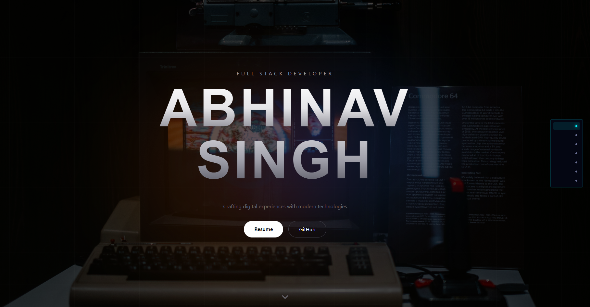

# Abhinav Singh | Portfolio

<div align="center">


**A retro-futuristic, scrollytelling portfolio with synthwave aesthetics**

[Live Demo](abhinavin.space) · [Report Bug](https://github.com/abhinavsingh1311/my-portfolio/issues) · [Request Feature](https://github.com/abhinavsingh1311/my-portfolio/issues)

</div>

---

## Preview

<div align="center">
  
  <p><em>Hero section with neon typography and animated grid</em></p>
</div>

---

## Features

### Design

- **Retro-Futuristic Theme** — Synthwave-inspired neon color palette (cyan, pink, yellow, purple)
- **Custom Typography** — Orbitron (headings), Space Grotesk (body), JetBrains Mono (code/terminal)
- **Glassmorphism Cards** — Frosted glass effects with backdrop blur
- **Neon Glow Effects** — Dynamic text shadows and border glows
- **Cyber Grid Backgrounds** — Animated grid patterns throughout

### Animations & Interactions

- **Scrollytelling** — Pinned sections with scroll-triggered content reveals
- **Parallax Effects** — Background images with fixed attachment
- **Typewriter Effect** — Animated poem reveal in Blog section
- **3D Card Tilt** — Perspective transforms on project cards
- **Scroll-Triggered Reveals** — Cards animate in from alternating directions
- **Interactive Hover States** — Glowing borders, scaling, color transitions

### Sections

| Section        | Features                                                        |
| -------------- | --------------------------------------------------------------- |
| **Hero**       | Zoom-through effect, neon name typography, animated CTA buttons |
| **About**      | Multi-panel story with pinned scroll, backdrop cards            |
| **Experience** | Fixed background, scroll-reveal cards with NODE badges          |
| **Skills**     | Interactive category cards, hoverable skill tags with glow      |
| **Projects**   | 3D tilt cards, featured badges, scan-line overlays              |
| **Blog**       | Terminal-style poem viewer with replay, article links           |
| **Contact**    | Copy-to-clipboard email, availability status indicator          |

---

## Tech Stack

| Category       | Technologies                                           |
| -------------- | ------------------------------------------------------ |
| **Framework**  | React 18 + TypeScript                                  |
| **Build Tool** | Vite                                                   |
| **Styling**    | Tailwind CSS 4.x                                       |
| **Animations** | GSAP (ScrollTrigger) + CSS Transitions                 |
| **Icons**      | Lucide React                                           |
| **Fonts**      | Google Fonts (Orbitron, Space Grotesk, JetBrains Mono) |

---

## Getting Started

### Prerequisites

- Node.js 18+
- npm or yarn

### Installation

1. **Clone the repository**

   ```bash
   git clone https://github.com/abhinavsingh1311/my-portfolio.git
   cd portfolio
   ```

2. **Install dependencies**

   ```bash
   npm install
   ```

3. **Add your images** to `public/projects/`:

   ```
   public/
   └── projects/
       ├── early-days.jpg     # About section
       ├── journey.gif        # Journey panel
       ├── afpi-mohali.jpg    # AFPI background
       ├── nait-logo.jpg      # Education logo
       ├── mixtape.png
       ├── whds.png
       ├── resumeAI.png
       └── capstone.png
   ```

4. **Start development server**

   ```bash
   npm run dev
   ```

5. **Build for production**
   ```bash
   npm run build
   ```

---

## Project Structure

```
src/
├── components/
│   ├── sections/
│   │   ├── HeroSection.tsx       # Intro with zoom effect
│   │   ├── AboutSection.tsx      # Multi-panel story
│   │   ├── ExperienceSection.tsx # Work history
│   │   ├── SkillsSection.tsx     # Interactive skill cards
│   │   ├── ProjectsSection.tsx   # Project gallery
│   │   ├── BlogSection.tsx       # Creative content
│   │   └── ContactSection.tsx    # Contact info
│   ├── ui/
│   │   ├── ScrollNav.tsx         # Side navigation dots
│   │   └── ParallaxImage.tsx     # Parallax image component
│   └── ErrorBoundary.tsx
├── data/
│   └── content.ts                # All portfolio content
├── App.tsx
├── App.css
├── index.css                     # Theme variables & utilities
└── main.tsx
```

---

## Customization

### Color Palette

Edit CSS variables in `src/index.css`:

```css
:root {
  /* Core palette */
  --bg-deep: #050816;
  --bg-surface: #0a0f1f;

  /* Neon accents */
  --neon-pink: #ff2e9f;
  --neon-cyan: #00f6ff;
  --neon-yellow: #fcee09;
  --neon-purple: #8a2be2;
  --neon-green: #00ffb3;

  /* Text */
  --text-primary: #ffffff;
  --text-secondary: #c4c6ff;
  --text-muted: #6b7194;
}
```

### Content

All content is centralized in `src/data/content.ts`:

```typescript
export const personalInfo = {
  name: "Name",
  title: "Title",
  email: "here@email.com",
  // ...
};

export const experiences = [
  {
    company: "Company Name",
    role: "Role",
    period: "Date Range",
    description: ["Point 1", "Point 2"],
    technologies: ["Tech1", "Tech2"],
    link: "https://company.com",
  },
];
```

### Adding New Sections

1. Create component in `src/components/sections/`
2. Import and add to `App.tsx`
3. Add to navigation in `ScrollNav.tsx`

---

## CSS Utilities

The theme includes custom utility classes:

| Class               | Effect                        |
| ------------------- | ----------------------------- |
| `.neon-text-pink`   | Glowing pink text             |
| `.neon-text-cyan`   | Glowing cyan text             |
| `.neon-border-pink` | Glowing pink border           |
| `.neon-border-cyan` | Glowing cyan border           |
| `.cyber-grid`       | Grid pattern background       |
| `.scanlines`        | CRT scan line overlay         |
| `.retro-card`       | Styled card with gradient top |
| `.corner-brackets`  | Corner accent decorations     |
| `.btn-neon`         | Animated neon button          |
| `.hologram`         | Animated gradient text        |

---

## Dependencies

```json
{
  "dependencies": {
    "react": "^18.x",
    "react-dom": "^18.x",
    "gsap": "^3.x",
    "lucide-react": "^0.x"
  },
  "devDependencies": {
    "@vitejs/plugin-react": "^4.x",
    "autoprefixer": "^10.x",
    "postcss": "^8.x",
    "tailwindcss": "^4.x",
    "typescript": "^5.x",
    "vite": "^5.x"
  }
}
```

---

## Performance Tips

- Images are lazy-loaded with `loading="lazy"`
- GSAP ScrollTrigger uses `scrub` for smooth animations
- `will-change` applied to transformed elements
- Backdrop filters used sparingly
- IntersectionObserver for scroll-triggered reveals

---

## License

This project is licensed under the MIT License - see the [LICENSE](LICENSE) file for details.

---

## Acknowledgments

- Design inspiration: GTA VI website, Lost in Space by Loom Studios
- [GSAP](https://greensock.com/gsap/) for animation library
- [Tailwind CSS](https://tailwindcss.com/) for styling
- [Lucide](https://lucide.dev/) for icons
- [Google Fonts](https://fonts.google.com/) for typography

---

## Contact

**Abhinav Singh** — Full Stack Developer

[](mailto:singhabhinav1311@gmail.com)
[](https://linkedin.com/in/singhabhinav13112002)
[](https://github.com/abhinavsingh1311)

---

<div align="center">
  <sub>Built with &#10084 by Abhinav Singh</sub>
</div>
